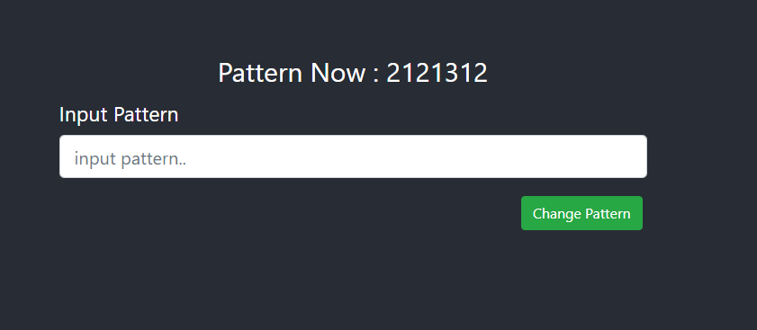

<h1 align="center">Website GameTab</h1>

  

 

  Built with React.js.

## Table of Contents

- [Introduction](#introduction)
- [Features](#features)
- [Requirements](#requirements)
- [Usage](#usage-for-development)
- [Screenshots](#screenshots)
- [Deploy Website](#deploy-website)
- [Contributors](#contributors)

## Introduction
ibrary is a website for borrowing books, where only members in this library can borrow books, and if a guest wants to borrow, the guest must log in first.

## Features
* Input Pattern for mobile App

## Requirements
* [`npm`](https://www.npmjs.com/get-npm)
* [`node.js`](https://nodejs.org/en/)
* [`Back End Gametab`](https://github.com/abdillahtop/back-end-gameTab)
* [`Android Gametab`](https://github.com/abdillahtop/Android-gameTab)

## Usage For Development
1. Open your terminal
2. Copy and Paste here `git clone https://github.com/abdillahtop/Website-GameTab.git`
3. cd `Website-GameTab` type `npm install` for install dependencies
4. type `npm start` fork run aplikasi.

## Screenshots

     

## Deploy Website

## Contributors

  <table>
    <tr>
      <td align="center">
        <a href="https://github.com/abdillahtop">
           
          <b>Abdillah Dzulfikar Mustanir</b>
        </a>
      </td>
    </tr>
  </table>

